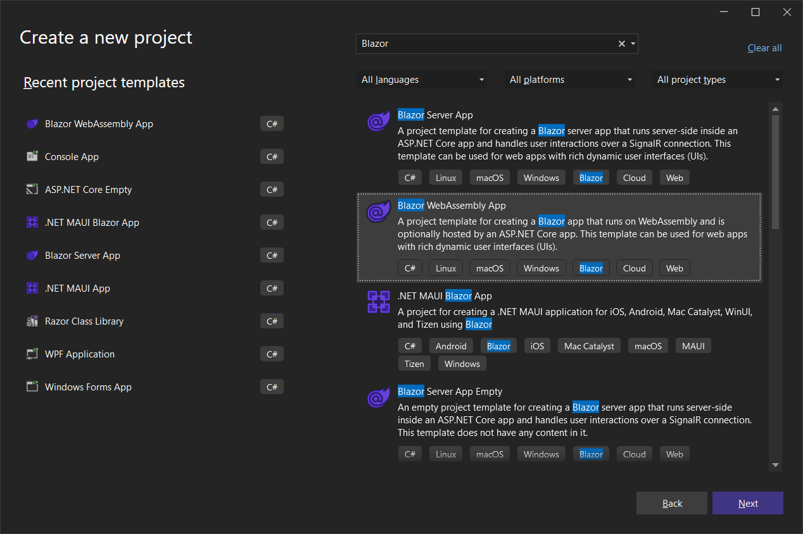
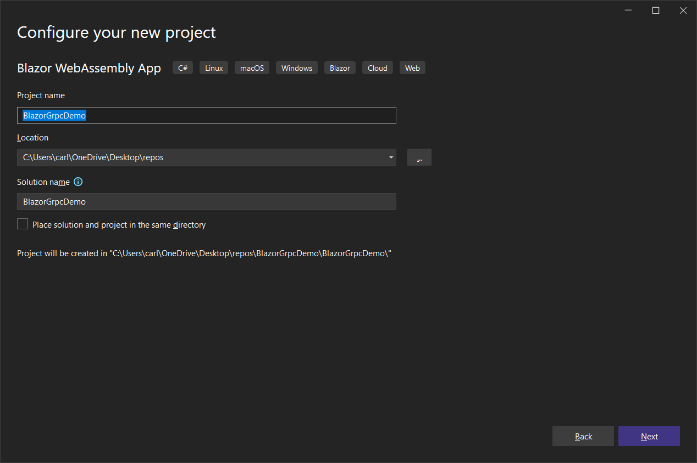
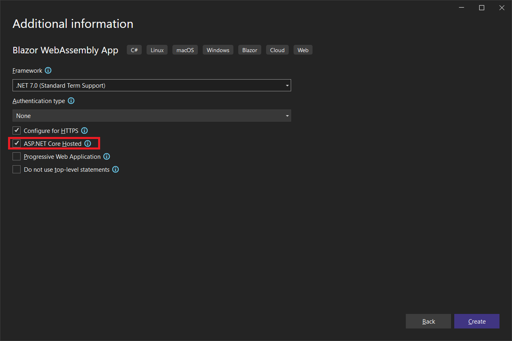
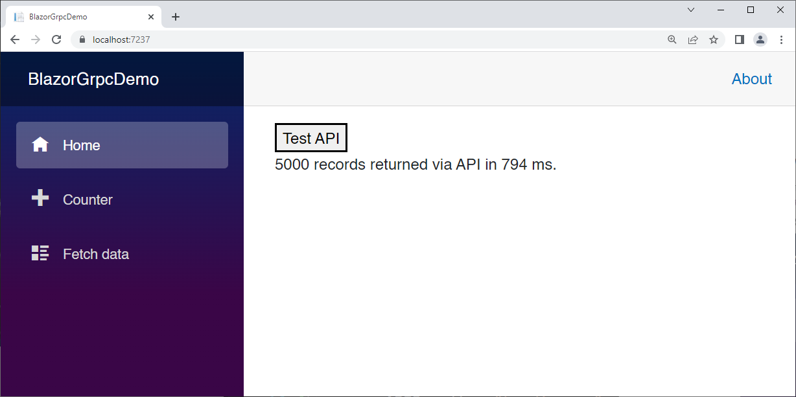
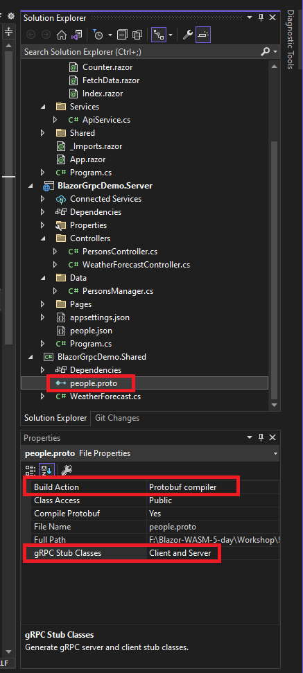
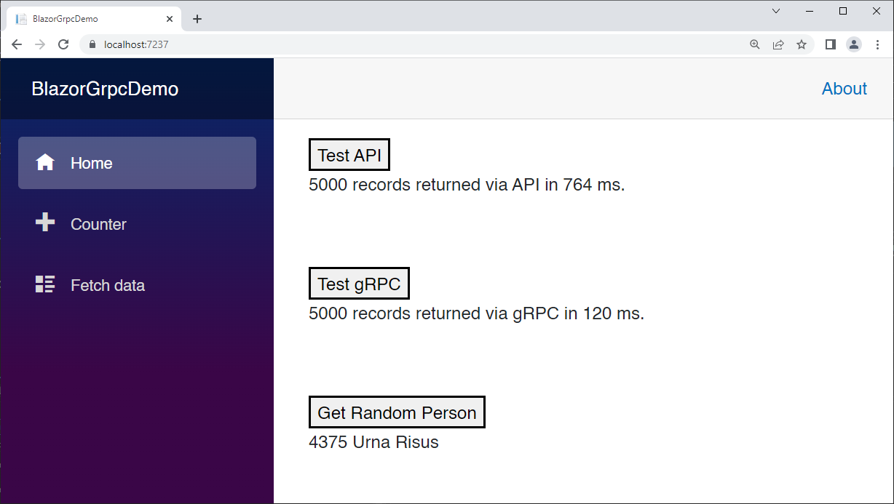

# WebAPI vs gRPC

In this module we will compare the performance of JSON via an ASP.NET Controller vs [gRPC](https://grpc.io/) by downloading 5000 model records with each technology.

[Click here for my repo comparing streaming with SignalR, WebAPI, and gRPC.](https://github.com/carlfranklin/BlazorStreamingDemo)

### What is gRPC?

[gRPC](https://grpc.io/) is a recursive acronym that stands for **g**RPC **R**emote **P**rocedure **C**alls. Event though it originated from Google in 2015, the g does not stand for Google, or so they say. gRPC is a standard that exists outside of .NET and even outside of Microsoft. It was developed as an efficient means of transporting messages between microservices. 

From https://grpc.io/: 

> gRPC is a modern open source high performance Remote Procedure Call (RPC) framework that can run in any environment. It can efficiently connect services in and across data centers with pluggable support for load balancing, tracing, health checking and authentication. It is also applicable in last mile of distributed computing to connect devices, mobile applications and browsers to backend services.

gRPC uses a language called "Proto" to express messages and services that are sent with "Protocol Buffers" (https://developers.google.com/protocol-buffers/), or *ProtoBuf* for short. Each platform must implement its own code generator to translate those messages and services into platform-specific implementations that use the ProtoBuf binary protocol. 

The result is extremely fast cross-platform communication.

#### gRPC-Web

gRPC-Web is an HTTP-based implementation of gRPC. gRPC requires HTTP/2, which is not directly exposed by browsers.

From https://github.com/grpc/grpc/blob/master/doc/PROTOCOL-WEB.md:

> gRPC-Web provides a JS client library that supports the same API as gRPC-Node to access a gRPC service. Due to browser limitation, the Web client library implements a different protocol than the [native gRPC protocol](https://github.com/grpc/grpc/blob/master/doc/PROTOCOL-HTTP2.md). This protocol is designed to make it easy for a proxy to translate between the protocols as this is the most likely deployment model.

In June, 2020, Microsoft's James Newton-King (inventor of Newtonsoft.Json) announced gRPC-Web support in .NET (https://devblogs.microsoft.com/dotnet/grpc-web-for-net-now-available/).

That means we can use gRPC(Web) in our Blazor apps to communicate with gRPC services, which we can implement in any ASP.NET Core server.

From https://devblogs.microsoft.com/dotnet/grpc-web-for-net-now-available/:

> gRPC is a modern high-performance RPC (Remote Procedure Call) framework. gRPC is based on HTTP/2, Protocol Buffers and other modern standard-based technologies. gRPC is an open standard and is supported by many programming languages, including .NET.

> It is currently impossible to implement the gRPC HTTP/2 spec in the browser because there are no browser APIs with enough fine-grained control over requests. [gRPC-Web](https://github.com/grpc/grpc/blob/master/doc/PROTOCOL-WEB.md) is a standardized protocol that solves this problem and makes gRPC usable in the browser. gRPC-Web brings many of gRPC’s great features, like small binary messages and contract-first APIs, to modern browser apps.

> We’ve worked with the Blazor team to make gRPC-Web a great end-to-end developer experience when used in Blazor WebAssembly apps. Not only will gRPC tooling automatically generate strongly typed clients for you to call gRPC services from your Blazor app, but gRPC offers significant performance benefits over JSON.

> A great example of the performance benefits in action is Blazor’s default template app. The data transferred on the fetch data page is **halved** when gRPC is used instead of JSON. Data size is reduced from 627 bytes down to 309 bytes.

So, let's get to it!

#### Create a new Hosted Blazor WebAssembly project called BlazorGrpcDemo







We're going to compare how long it takes to access 5000 records (never do this) via gRPC vs a standard API controller.

##### Add the Model

To the Shared project, add the following:

*Person.cs*:

```c#
namespace BlazorGrpcDemo.Shared;

public class Person
{
    public int Id { get; set; }
    public string FirstName { get; set; } = "";
    public string LastName { get; set; } = "";
    public string Bio { get; set; } = "";
    public string PhotoUrl { get; set; } = "generic-person.png";
}
```

##### Server Configuration

Download https://blazortrain.com/people.json and save it to the Server project.

This file contains 5000 bogus Person records.

To the Server project, add a *Data* folder, and add the following class:

*PersonsManager.cs*:

```c#
using System.Text.Json;
using BlazorGrpcDemo.Shared;

namespace BlazorGrpcDemo.Server.Data;

public class PersonsManager
{
	public List<Person> People { get; set; }

	public PersonsManager()
	{
		string filename = $"{Environment.CurrentDirectory}\\people.json";
		if (File.Exists(filename))
		{
			string json = File.ReadAllText(filename);
			People = JsonSerializer.Deserialize<List<Person>>(json);
		}
	}
}
```

Typically, on the server side, a manager would access the data via Entity Framework or some other data access tech. In our case, we're loading *people.json* in the constructor, and deserializing it into our `public List<Person> People` property.

To the *Controllers* folder, add the following class:

*PersonsController.cs*:

```c#
using Microsoft.AspNetCore.Mvc;
using BlazorGrpcDemo.Server.Data;
using BlazorGrpcDemo.Shared;

namespace BlazorGrpcDemo.Server.Controllers;

[Route("[controller]")]
[ApiController]
public class PersonsController : Controller
{
	PersonsManager personsManager;

	public PersonsController(PersonsManager _personsManager)
	{
		personsManager = _personsManager;

	}

	[HttpGet]
	public List<Person> GetAll()
	{
		return personsManager.People;
	}

	[HttpGet("{Id}/getbyid")]
	public Person GetPersonById(int Id)
	{
		return (from x in personsManager.People
					  where x.Id == Id
					  select x).FirstOrDefault();
	}
}
```

This controller has two endpoints, one for retrieving all of the `Person` objects in a list, and one for retrieving a single `Person` given their Id. The Ids start at 1 and end at 5000.

Add the following line to the Server project's *Program.cs* file just before the line `var app = builder.Build();`

```c#
builder.Services.AddSingleton<PersonsManager>();
```

##### Client Configuration

To the Client project, add a *Services* folder, and add the following class to it:

*ApiService.cs*:

```c#
using System.Text.Json;
using BlazorGrpcDemo.Shared;

namespace BlazorGrpcDemo.Client.Services;

public class ApiService
{
    HttpClient http;

    public ApiService(HttpClient _http)
    {
        http = _http;
    }

    public async Task<List<Person>> GetAll()
    {
        try
        {
            var result = await http.GetAsync("persons");
            result.EnsureSuccessStatusCode();
            string responseBody = await result.Content.ReadAsStringAsync();
            return JsonSerializer.Deserialize<List<Person>>(responseBody);
        }
        catch (Exception ex)
        {
            var msg = ex.Message;
            return null;
        }
    }

    public async Task<Person> GetPersonById(int Id)
    {
        try
        {
            var result = await http.GetAsync($"persons/{Id}/getbyid");
            result.EnsureSuccessStatusCode();
            string responseBody = await result.Content.ReadAsStringAsync();
            return JsonSerializer.Deserialize<Person>(responseBody);
        }
        catch (Exception ex)
        {
            return null;
        }
    }
}
```

We're injecting the `HttpClient`, on which the `BaseAddress` is already set.

This code simply makes HTTP calls to our API Controller and returns the results.

Add the following to the Client project's *Program.cs* just above the line `await builder.Build().RunAsync();`

```c#
builder.Services.AddScoped<ApiService>();
```

Add the following to *_Imports.razor*:

```
@using BlazorGrpcDemo.Client.Services
@using BlazorGrpcDemo.Shared
```

Replace *Pages/Index.razor* with the following:

```c#
@page "/"
@inject ApiService ApiService

<button @onclick="APIButtonClicked">Test API</button>
<br/>
<p>@APIResult</p>
<br/>

@code {

    string APIResult = "";
    List<Person> People;

    async Task APIButtonClicked()
    {
        APIResult = "Loading...";
        await InvokeAsync(StateHasChanged);
        var startTime = DateTime.Now;
        People = await ApiService.GetAll();
        if (People != null)
        {
            var elapsed = DateTime.Now.Subtract(startTime);
            APIResult = $"{People.Count} records returned via API in {elapsed.TotalMilliseconds} ms.";
        }
    }

}
```

This markup and code is fairly easy to understand. We are measuring the time it takes between making the API call and retrieving the data, then we're reporting the elapsed time to the user.

Run the App (F5) and select the **Test API** button.

This is what I get on my machine, which is pretty fast:


That 890ms included the time it took to compile.

Select **Test API** again to get a more honest number:



#### Add gRPC code

Now let's see if we can beat that number using gRPC instead of JSON over HTTP.

##### Add NuGet Packages

Each project needs their own set of packages.

*BlazorGrpcDemo.Shared.csproj*:

```xml
<ItemGroup>
    <PackageReference Include="Google.Protobuf" Version="3.23.2" />
    <PackageReference Include="Grpc.Net.Client" Version="2.53.0" />
    <PackageReference Include="Grpc.Tools" Version="2.54.0">
        <PrivateAssets>all</PrivateAssets>
        <IncludeAssets>runtime; build; native; contentfiles; analyzers; buildtransitive</IncludeAssets>
    </PackageReference>
</ItemGroup>
```

 *BlazorGrpcDemo.Server.csproj*:

```xml
<PackageReference Include="Grpc.AspNetCore" Version="2.53.0" />
<PackageReference Include="Grpc.AspNetCore.Web" Version="2.53.0" />
```

 *BlazorGrpcDemo.Client.csproj*:

```xml
<PackageReference Include="System.Net.Http.Json" Version="7.0.1" />
<PackageReference Include="Grpc.Net.Client.Web" Version="2.53.0" />
```

##### Delete *Person.cs* from the Shared project.

With gRPC we are going to re-create this class as a message using the **Proto** language. **Proto** is used by the .NET gRPC-Web system to generate a C# `Person` class under the hood, which will be used by the gRPC subsystem.

Add a file called *people.proto* to the Shared project:

```protobuf
syntax = "proto3"; 
option csharp_namespace = "BlazorGrpcDemo.Shared"; 
package PeoplePackage; 

service People { 
	rpc GetAll (GetAllPeopleRequest) returns (PeopleReply); 
	rpc GetPersonById (GetPersonByIdRequest) returns (Person);
} 

message GetAllPeopleRequest {

}

message GetPersonByIdRequest {
	int32 id = 1;
}

message PeopleReply { 
	repeated Person people = 1; 
} 

message Person { 
	int32 id = 1; 
	string firstName = 2; 
	string lastName = 3; 
	string bio = 4; 
	string photoUrl = 5; 
}
```

Bring up the Property Window for *people.proto*.

Set the **Build Action** to **Protobuf compiler**, and ensure that the **gRPC Stub Classes** property is set to **Client and Server**



OK, let's talk about this file starting with the `Person` message:

```protobuf
message Person { 
	int32 id = 1; 
	string firstName = 2; 
	string lastName = 3; 
	string bio = 4; 
	string photoUrl = 5; 
}
```

The `message` keyword defines a message. Think of it as a C# class, but it's merely the prototype for a C# class. The actual class will be generated. The designers of proto tried to create a language-agnostic prototyping language with all the information needed for each platform to generate actual classes.

One difference you may notice immediately is the lack of scope keywords (private, public, etc.) because fields are always public. 

The next thing is that field names are always camel cased.

But the elephant in the room is the ordinals attached to each field. ProtoBuf uses a binary serialization system. Fields are identified by number under the hood. 

Next, look at the service definition:

```protobuf
service People { 
	rpc GetAll (GetAllPeopleRequest) returns (PeopleReply); 
	rpc GetPersonById (GetPersonByIdRequest) returns (Person);
} 
```

Every service takes one input message type and returns one output message type. There are no exceptions.

So even though this line...

```protobuf
rpc GetAll (GetAllPeopleRequest) returns (PeopleReply); 
```

...defines a service where there is no input required, we still have to define and pass a blank message:

```protobuf
message GetAllPeopleRequest {

}
```

Next, look at PeopleReply:

```protobuf
message PeopleReply { 
	repeated Person people = 1; 
} 
```

The `repeated` keyword is a language-agnostic way to represent a list, array, or other collection of messages. 

The GetPersonByIdRequest message is straight-ahead:

```protobuf
message GetPersonByIdRequest {
	int32 id = 1;
}
```

##### Build the Solution

The code generator will build the classes and infrastructure.

#### Server Configuration

##### Implement the Service in C#

Add the following to the Server project's *Data* folder:

```c#
using Grpc.Core;
using BlazorGrpcDemo.Shared;
using BlazorGrpcDemo.Server.Data;

public class PeopleService : People.PeopleBase
{
    PersonsManager personsManager;

    public PeopleService(PersonsManager _personsManager)
    {
        personsManager = _personsManager;
    }

    public override Task<PeopleReply> GetAll(GetAllPeopleRequest request,
        ServerCallContext context)
    {
        var reply = new PeopleReply();
        reply.People.AddRange(personsManager.People);
        return Task.FromResult(reply);
    }

    public override Task<Person> GetPersonById(GetPersonByIdRequest request,
        ServerCallContext context)
    {
        var result = (from x in personsManager.People
                      where x.Id == request.Id
                      select x).FirstOrDefault();
        return Task.FromResult(result);
    }
}
```

Notice that the class `PeopleBase` already exists and we need to simply inherit it and override the existing virtual methods.

We're injecting our `PersonsManager` into the service.

At first blush, this looks like an API controller, doesn't it? 

Add the following to the Server project's *Program.cs* just above the line `var app = builder.Build();`

```c#
builder.Services.AddGrpc();
```

Add these lines just below the line `app.UseRouting();`

```c#
app.UseGrpcWeb();
app.MapGrpcService<PeopleService>().EnableGrpcWeb();
```

You must call `app.MapGrpcService` for every service that you want to use.

##### Client Configuration

Add the following to the Client project's *Program.cs* file right above the line `await builder.Build().RunAsync();`

```c#
builder.Services.AddSingleton(services =>
{
    var httpClient = new HttpClient(new GrpcWebHandler(GrpcWebMode.GrpcWeb, 
			new HttpClientHandler()));
    var baseUri = services.GetRequiredService<NavigationManager>().BaseUri;
    var channel = GrpcChannel.ForAddress(baseUri, 
			new GrpcChannelOptions { HttpClient = httpClient });
    return new People.PeopleClient(channel);
});
```

We're adding a Singleton, creating a new `HttpClient` to access the service. We're getting the BaseUri from a new `NavigationManager`. Then we're creating `GrpcChannel` passing the `HttpClient` in the options. Finally, we're returning a `People.PeopleClient` passing in the `GrpcChannel`. 

Replace *Index.razor* with the following:

```c#
@page "/"
@inject ApiService ApiService
@inject People.PeopleClient PeopleClient

<button @onclick="APIButtonClicked">Test API</button>
<br />
<p>@APIResult</p>
<br />
<br />

<button @onclick="GRPCButtonClicked">Test gRPC</button>
<br />
<p>@GRPCResult</p>
<br />
<br />

<button @onclick="GRPCGetRandomPersonButtonClicked">Get Random Person</button>
<br />
<p>@PersonResult</p>

@code

{
    string APIResult = "";
    string GRPCResult = "";
    string PersonResult = "";
    List<Person> People;

    async Task APIButtonClicked()
    {
        APIResult = "Loading...";
        await InvokeAsync(StateHasChanged);
        var startTime = DateTime.Now;
        People = await ApiService.GetAll();
        if (People != null)
        {
            var elapsed = DateTime.Now.Subtract(startTime);
            APIResult = $"{People.Count} records returned via API in {elapsed.TotalMilliseconds} ms.";
            await InvokeAsync(StateHasChanged);
        }
    }

    async Task GRPCButtonClicked()
    {
        GRPCResult = "Loading...";
        await InvokeAsync(StateHasChanged);

        var startTime = DateTime.Now;
        var list = await PeopleClient.GetAllAsync(new GetAllPeopleRequest());

        if (list != null)
        {
            People = list.People.ToList();
            var elapsed = DateTime.Now.Subtract(startTime);
            GRPCResult = $"{People.Count} records returned via gRPC in {elapsed.TotalMilliseconds} ms.";
            await InvokeAsync(StateHasChanged);
        }
    }

    async Task GRPCGetRandomPersonButtonClicked()
    {
        var obj = new object();
        var rnd = new Random(obj.GetHashCode());
        int RandomId = rnd.Next(1, 5000);
        var request = new GetPersonByIdRequest { Id = RandomId };

        var person = await PeopleClient.GetPersonByIdAsync(request);

        if (person != null)
        {
            PersonResult = $"{person.Id} {person.FirstName} {person.LastName}";
            await InvokeAsync(StateHasChanged);
        }
    }
}
```

We still kept the API code in tact, but now we're injecting a `People.PeopleClient`, which we can use to call our gRPC service. The time measuring code is exactly the same for gRPC as it is for the API.

Run the App (F5) and test both the API and gRPC methods multiple times. 



gRPC still performing more than twice as fast as JSON over HTTP.

This is by no means an extended tutorial on gRPC, nor is it prescriptive. In general, I don't think you should be downloading 5000 records in production, even if it only take 120 milliseconds.

However, I hope I've motivated you to learn more about gRPC and use it where it makes sense.